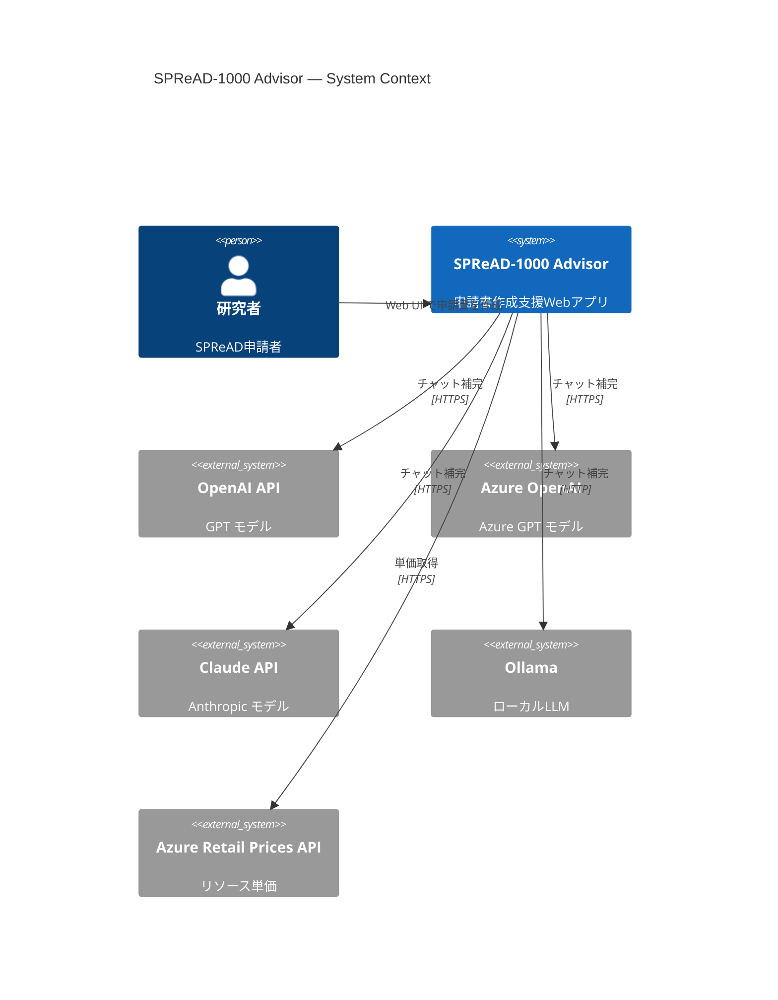
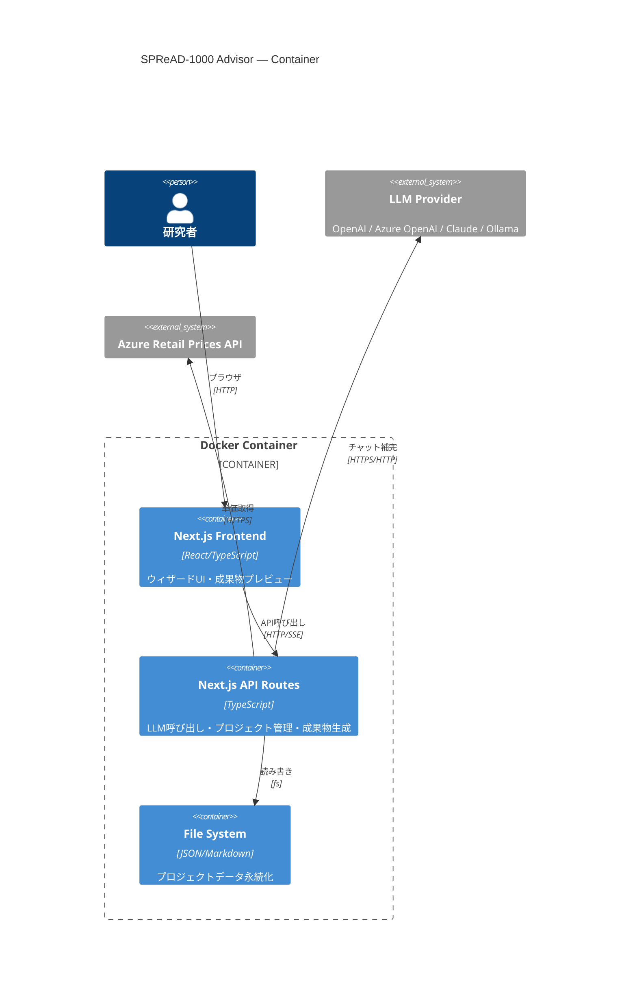
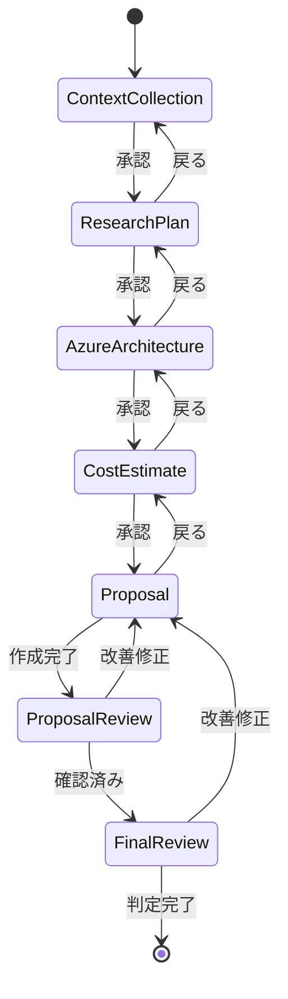
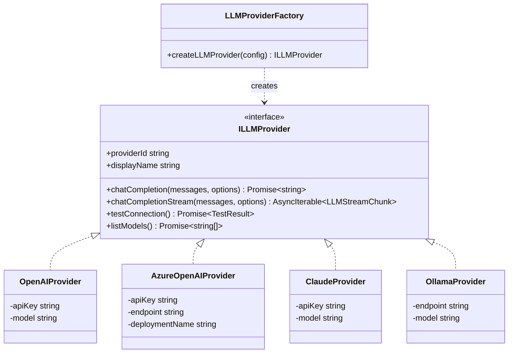

# DES-SPREAD1000-ADVISOR-001: SPReAD-1000 申請書作成支援システム 設計書

**バージョン**: v1.0.0
**ステータス**: Draft
**作成日**: 2026-05-02
**トレーサビリティ**: REQ-SPREAD1000-ADVISOR-001 v1.0.0

---

## 1. アーキテクチャ概要

### 1.1 設計方針

本システムは Next.js フルスタックアプリケーションとして、以下の設計原則に従う:

- **関心の分離**: Domain / Application / Infrastructure / Interface の4層
- **依存性逆転 (DIP)**: ドメイン層がインターフェースを定義し、インフラ層が実装
- **単一責任 (SRP)**: 各コンポーネントは1つの責務のみを持つ
- **開放閉鎖 (OCP)**: LLM プロバイダーの追加が既存コードの変更なしに可能
- **インターフェース分離 (ISP)**: クライアントが使わないメソッドに依存しない

### 1.2 C4 Context Diagram



### 1.3 C4 Container Diagram



### 1.4 ディレクトリ構成

```
spread1000-advisor/
├── src/
│   ├── app/                          # Next.js App Router
│   │   ├── layout.tsx                # ルートレイアウト
│   │   ├── page.tsx                  # ホーム（プロジェクト一覧）
│   │   ├── projects/
│   │   │   └── [projectId]/
│   │   │       ├── page.tsx          # ウィザードメインページ
│   │   │       └── layout.tsx
│   │   ├── settings/
│   │   │   └── page.tsx              # LLM設定画面
│   │   └── api/
│   │       ├── projects/             # プロジェクトCRUD
│   │       ├── llm/                  # LLM呼び出し（SSE）
│   │       ├── cost/                 # Azure Prices API proxy
│   │       ├── export/               # 成果物ダウンロード
│   │       └── settings/             # 設定管理
│   │
│   ├── domain/                       # ドメイン層
│   │   ├── models/                   # ドメインモデル
│   │   │   ├── Project.ts
│   │   │   ├── WizardStep.ts
│   │   │   ├── MetaPrompt.ts
│   │   │   ├── ResearchPlan.ts
│   │   │   ├── AzureArchitecture.ts
│   │   │   ├── CostEstimate.ts
│   │   │   ├── Proposal.ts
│   │   │   └── ReviewReport.ts
│   │   ├── interfaces/               # ポートインターフェース
│   │   │   ├── ILLMProvider.ts
│   │   │   ├── IProjectRepository.ts
│   │   │   ├── ICostService.ts
│   │   │   └── IExportService.ts
│   │   └── values/                   # 値オブジェクト
│   │       ├── CharacterCount.ts
│   │       ├── Budget.ts
│   │       └── ReviewScore.ts
│   │
│   ├── application/                  # アプリケーション層
│   │   ├── usecases/
│   │   │   ├── CollectContextUseCase.ts
│   │   │   ├── GenerateResearchPlanUseCase.ts
│   │   │   ├── DesignAzureArchitectureUseCase.ts
│   │   │   ├── EstimateCostUseCase.ts
│   │   │   ├── GenerateProposalUseCase.ts
│   │   │   ├── ReviewProposalUseCase.ts
│   │   │   ├── FinalReviewUseCase.ts
│   │   │   └── ExportDeliverableUseCase.ts
│   │   ├── prompts/                  # LLMプロンプトテンプレート
│   │   │   ├── context-collector.ts
│   │   │   ├── research-planner.ts
│   │   │   ├── azure-architect.ts
│   │   │   ├── proposal-writer.ts
│   │   │   ├── proposal-reviewer.ts
│   │   │   └── final-reviewer.ts
│   │   └── services/
│   │       ├── WizardService.ts
│   │       └── ValidationService.ts
│   │
│   ├── infrastructure/               # インフラストラクチャ層
│   │   ├── llm/                      # LLMプロバイダー実装
│   │   │   ├── OpenAIProvider.ts
│   │   │   ├── AzureOpenAIProvider.ts
│   │   │   ├── ClaudeProvider.ts
│   │   │   ├── OllamaProvider.ts
│   │   │   └── LLMProviderFactory.ts
│   │   ├── persistence/
│   │   │   └── FileProjectRepository.ts
│   │   ├── cost/
│   │   │   └── AzureRetailPriceService.ts
│   │   ├── export/
│   │   │   ├── MarkdownExporter.ts
│   │   │   ├── ExcelExporter.ts
│   │   │   └── ZipExporter.ts
│   │   └── config/
│   │       └── ConfigManager.ts
│   │
│   ├── components/                   # UIコンポーネント
│   │   ├── wizard/
│   │   │   ├── WizardLayout.tsx
│   │   │   ├── StepIndicator.tsx
│   │   │   ├── ContextCollectorStep.tsx
│   │   │   ├── ResearchPlanStep.tsx
│   │   │   ├── AzureArchitectStep.tsx
│   │   │   ├── CostEstimateStep.tsx
│   │   │   ├── ProposalStep.tsx
│   │   │   ├── ProposalReviewStep.tsx
│   │   │   └── FinalReviewStep.tsx
│   │   ├── editor/
│   │   │   ├── MarkdownEditor.tsx
│   │   │   ├── MarkdownPreview.tsx
│   │   │   └── CharacterCounter.tsx
│   │   ├── settings/
│   │   │   └── LLMSettingsForm.tsx
│   │   ├── common/
│   │   │   ├── StreamingText.tsx
│   │   │   ├── ErrorBoundary.tsx
│   │   │   └── LoadingSpinner.tsx
│   │   └── layout/
│   │       ├── Header.tsx
│   │       ├── LanguageToggle.tsx
│   │       └── ProjectSelector.tsx
│   │
│   ├── hooks/                        # Reactカスタムフック
│   │   ├── useLLMStream.ts
│   │   ├── useProject.ts
│   │   ├── useWizardStep.ts
│   │   └── useAutoSave.ts
│   │
│   ├── i18n/                         # 国際化
│   │   ├── config.ts
│   │   ├── ja.json
│   │   └── en.json
│   │
│   └── lib/                          # ユーティリティ
│       ├── sanitize.ts
│       ├── validation.ts
│       └── disclaimer.ts
│
├── data/                             # プロジェクトデータ（Docker volume）
│   └── projects/
│       └── {project-name}/
│           ├── project.json          # メタデータ・進捗状態
│           ├── meta-prompt.md
│           ├── phase0-research-plan.md
│           ├── phase1-azure-architecture.md
│           ├── phase2-cost-estimate.md
│           ├── phase3-proposal.md
│           ├── review-report.md
│           └── final-review-report.md
│
├── Dockerfile
├── docker-compose.yml
├── next.config.ts
├── package.json
└── tsconfig.json
```

---

## 2. ドメインモデル設計

### DES-SA-001: ウィザードステップ管理

**トレーサビリティ**: REQ-SA-001, REQ-SA-053
**パッケージ**: `domain/models`

**設計概要**:
ウィザードの全体フローをステートマシンとして管理する。
各ステップは独立した状態を持ち、前方・後方遷移が可能。

```typescript
// domain/models/WizardStep.ts

export enum StepId {
  CONTEXT_COLLECTION = 'context-collection',
  RESEARCH_PLAN = 'research-plan',
  AZURE_ARCHITECTURE = 'azure-architecture',
  COST_ESTIMATE = 'cost-estimate',
  PROPOSAL = 'proposal',
  PROPOSAL_REVIEW = 'proposal-review',
  FINAL_REVIEW = 'final-review',
}

export enum StepStatus {
  NOT_STARTED = 'not_started',
  IN_PROGRESS = 'in_progress',
  COMPLETED = 'completed',
}

export interface WizardState {
  readonly projectId: string;
  readonly currentStep: StepId;
  readonly steps: Record<StepId, StepStatus>;
  readonly createdAt: string;
  readonly updatedAt: string;
}

export const STEP_ORDER: readonly StepId[] = [
  StepId.CONTEXT_COLLECTION,
  StepId.RESEARCH_PLAN,
  StepId.AZURE_ARCHITECTURE,
  StepId.COST_ESTIMATE,
  StepId.PROPOSAL,
  StepId.PROPOSAL_REVIEW,
  StepId.FINAL_REVIEW,
] as const;

export function canAdvance(state: WizardState, targetStep: StepId): boolean {
  const currentIndex = STEP_ORDER.indexOf(state.currentStep);
  const targetIndex = STEP_ORDER.indexOf(targetStep);

  if (targetIndex <= currentIndex) return true; // 後方遷移は常に可能
  if (targetIndex !== currentIndex + 1) return false; // 1ステップずつ前進

  return state.steps[state.currentStep] === StepStatus.COMPLETED;
}
```



---

### DES-SA-002: コンテキスト収集モデル

**トレーサビリティ**: REQ-SA-002
**パッケージ**: `domain/models`

**設計概要**:
6要素のメタプロンプト構造を定義する。各要素の充足状態を追跡し、
1問1答の質問フローを制御する。

```typescript
// domain/models/MetaPrompt.ts

export interface MetaPromptElement {
  readonly key: MetaPromptKey;
  readonly value: string | null;
  readonly source: 'user' | 'estimated';
  readonly confirmed: boolean;
}

export type MetaPromptKey =
  | 'PURPOSE'
  | 'TARGET'
  | 'SCOPE'
  | 'TIMELINE'
  | 'CONSTRAINTS'
  | 'DELIVERABLES';

export interface MetaPrompt {
  readonly elements: Record<MetaPromptKey, MetaPromptElement>;
  readonly approved: boolean;
}

export function isSufficient(prompt: MetaPrompt): boolean {
  const values = Object.values(prompt.elements);
  return values.every((e) => e.value !== null && e.confirmed);
}

export function getNextQuestion(prompt: MetaPrompt): MetaPromptKey | null {
  const order: MetaPromptKey[] = [
    'PURPOSE', 'TARGET', 'SCOPE', 'TIMELINE', 'CONSTRAINTS', 'DELIVERABLES',
  ];
  return order.find((key) => {
    const elem = prompt.elements[key];
    return !elem || elem.value === null || !elem.confirmed;
  }) ?? null;
}
```

---

### DES-SA-005: コスト見積もりモデル

**トレーサビリティ**: REQ-SA-005, REQ-SA-054, REQ-SA-090
**パッケージ**: `domain/models`

**設計概要**:
Azure リソースのコスト見積もりを構造化する。価格検証状態を追跡し、
予算制約（直接経費 ≤ 500万円）のバリデーションを提供する。

```typescript
// domain/models/CostEstimate.ts

export type PriceVerificationStatus = 'api_verified' | 'estimated';

export interface CostLineItem {
  readonly resourceName: string;
  readonly sku: string;
  readonly region: string;
  readonly quantity: number;
  readonly unit: string;
  readonly unitPrice: number;
  readonly monthlyTotal: number;
  readonly verificationStatus: PriceVerificationStatus;
  readonly retailPriceId?: string;
}

export interface CostEstimate {
  readonly items: readonly CostLineItem[];
  readonly directCostTotal: number;    // 直接経費
  readonly indirectCostRate: 0.3;      // 間接経費率 30%
  readonly indirectCostTotal: number;  // 間接経費
  readonly grandTotal: number;         // 合計
  readonly currency: 'JPY';
  readonly retrievedAt: string | null; // API取得日時
}

export const DIRECT_COST_LIMIT = 5_000_000; // 500万円

export function validateBudget(estimate: CostEstimate): BudgetValidation {
  return {
    withinLimit: estimate.directCostTotal <= DIRECT_COST_LIMIT,
    indirectCorrect:
      Math.abs(estimate.indirectCostTotal - estimate.directCostTotal * 0.3) < 1,
    allPricesVerified: estimate.items.every(
      (i) => i.verificationStatus === 'api_verified'
    ),
    hasUnverifiedWarning: estimate.items.some(
      (i) => i.verificationStatus === 'estimated'
    ),
  };
}

export interface BudgetValidation {
  readonly withinLimit: boolean;
  readonly indirectCorrect: boolean;
  readonly allPricesVerified: boolean;
  readonly hasUnverifiedWarning: boolean;
}
```

---

### DES-SA-006: 申請書モデル

**トレーサビリティ**: REQ-SA-006, REQ-SA-090
**パッケージ**: `domain/models`

**設計概要**:
SPReAD 様式1 の各セクション構造を定義する。文字数制限のバリデーションを内包する。

```typescript
// domain/models/Proposal.ts

export interface ProposalSection {
  readonly id: ProposalSectionId;
  readonly title: string;
  readonly content: string;
  readonly charLimit: { min: number; max: number };
}

export type ProposalSectionId =
  | 'research_purpose'
  | 'research_method'
  | 'ai_validity'
  | 'achievement_goals'
  | 'knowhow_sharing'
  | 'research_achievements'
  | 'expense_plan';

export const SECTION_CHAR_LIMITS: Record<
  ProposalSectionId,
  { min: number; max: number }
> = {
  research_purpose:      { min: 80, max: 400 },
  research_method:       { min: 160, max: 800 },
  ai_validity:           { min: 160, max: 800 },
  achievement_goals:     { min: 100, max: 500 },
  knowhow_sharing:       { min: 60, max: 300 },
  research_achievements: { min: 0, max: 1000 },
  expense_plan:          { min: 0, max: 2000 },
};

export interface Proposal {
  readonly projectId: string;
  readonly sections: readonly ProposalSection[];
  readonly createdAt: string;
  readonly updatedAt: string;
}

export function validateCharacterCount(section: ProposalSection): {
  valid: boolean;
  current: number;
  utilization: number;
} {
  const current = section.content.length;
  const { min, max } = section.charLimit;
  return {
    valid: current >= min && current <= max,
    current,
    utilization: max > 0 ? current / max : 0,
  };
}
```

---

### DES-SA-007: レビュースコアモデル

**トレーサビリティ**: REQ-SA-007, REQ-SA-008
**パッケージ**: `domain/values`

**設計概要**:
6審査観点のスコアリング体系を定義する。

```typescript
// domain/values/ReviewScore.ts

export type ScoreGrade = '◎' | '○' | '△' | '×';

export const GRADE_POINTS: Record<ScoreGrade, number> = {
  '◎': 3, '○': 2, '△': 1, '×': 0,
};

export interface CriterionScore {
  readonly criterionId: ReviewCriterionId;
  readonly criterionName: string;
  readonly grade: ScoreGrade;
  readonly points: number;
  readonly suggestion: string;
}

export type ReviewCriterionId =
  | 'ai_validity'
  | 'research_track_record'
  | 'plan_budget_validity'
  | 'novelty_superiority'
  | 'knowhow_sharing'
  | 'impact_potential';

export type SubmissionJudgment = '🟢' | '🟡' | '🔴';

export interface ReviewResult {
  readonly criteria: readonly CriterionScore[];
  readonly totalScore: number;       // 18点満点
  readonly judgment: SubmissionJudgment;
  readonly mandatoryChecks: readonly MandatoryCheckResult[];
  readonly crossPhaseChecks: readonly CrossPhaseCheckResult[];
  readonly actionItems: readonly ActionItem[];
}

export function calculateJudgment(
  totalScore: number,
  allPricesVerified: boolean,
  mandatoryFailures: number
): SubmissionJudgment {
  if (mandatoryFailures > 0) return '🔴';
  if (!allPricesVerified) return '🟡'; // 未検証価格がある場合は提出推奨しない
  if (totalScore >= 15) return '🟢';
  if (totalScore >= 10) return '🟡';
  return '🔴';
}

export interface MandatoryCheckResult {
  readonly item: string;
  readonly passed: boolean;
}

export interface CrossPhaseCheckResult {
  readonly check: string;
  readonly phases: string;
  readonly status: 'pass' | 'warning' | 'fail';
  readonly detail: string;
}

export interface ActionItem {
  readonly priority: 'High' | 'Medium' | 'Low';
  readonly description: string;
  readonly relatedSection: string;
}
```

---

## 3. インターフェース設計

### DES-SA-010: LLM プロバイダーインターフェース

**トレーサビリティ**: REQ-SA-010, REQ-SA-011, REQ-SA-012, REQ-SA-052
**パッケージ**: `domain/interfaces`

**設計概要**:
Strategy パターンにより LLM プロバイダーを抽象化する。
Factory パターンで設定に基づくプロバイダーの生成を行う。

```typescript
// domain/interfaces/ILLMProvider.ts

export interface ChatMessage {
  readonly role: 'system' | 'user' | 'assistant';
  readonly content: string;
}

export interface ChatCompletionOptions {
  readonly model?: string;
  readonly temperature?: number;
  readonly maxTokens?: number;
  readonly stream?: boolean;
  readonly signal?: AbortSignal;
}

export interface LLMStreamChunk {
  readonly content: string;
  readonly done: boolean;
}

export interface ILLMProvider {
  readonly providerId: string;
  readonly displayName: string;

  chatCompletion(
    messages: ChatMessage[],
    options?: ChatCompletionOptions
  ): Promise<string>;

  chatCompletionStream(
    messages: ChatMessage[],
    options?: ChatCompletionOptions
  ): AsyncIterable<LLMStreamChunk>;

  testConnection(): Promise<{ ok: boolean; error?: string }>;

  listModels?(): Promise<string[]>;
}
```

```typescript
// infrastructure/llm/LLMProviderFactory.ts

export type ProviderType = 'openai' | 'azure-openai' | 'claude' | 'ollama';

export interface LLMProviderConfig {
  readonly type: ProviderType;
  readonly apiKey?: string;
  readonly endpoint?: string;
  readonly model: string;
  readonly deploymentName?: string; // Azure OpenAI のみ
}

export function createLLMProvider(config: LLMProviderConfig): ILLMProvider {
  switch (config.type) {
    case 'openai':       return new OpenAIProvider(config);
    case 'azure-openai': return new AzureOpenAIProvider(config);
    case 'claude':       return new ClaudeProvider(config);
    case 'ollama':       return new OllamaProvider(config);
    default:
      throw new Error(`Unknown provider type: ${config.type}`);
  }
}
```



---

### DES-SA-020: プロジェクトリポジトリインターフェース

**トレーサビリティ**: REQ-SA-021, REQ-SA-053
**パッケージ**: `domain/interfaces`

**設計概要**:
プロジェクトデータの永続化を抽象化する。

```typescript
// domain/interfaces/IProjectRepository.ts

export interface ProjectMeta {
  readonly id: string;
  readonly name: string;
  readonly wizardState: WizardState;
  readonly llmProvider: ProviderType;
  readonly createdAt: string;
  readonly updatedAt: string;
}

export interface IProjectRepository {
  list(): Promise<ProjectMeta[]>;
  get(projectId: string): Promise<ProjectMeta | null>;
  create(name: string): Promise<ProjectMeta>;
  updateWizardState(projectId: string, state: Partial<WizardState>): Promise<void>;

  saveDeliverable(projectId: string, filename: DeliverableName, content: string): Promise<void>;
  loadDeliverable(projectId: string, filename: DeliverableName): Promise<string | null>;
  listDeliverables(projectId: string): Promise<DeliverableName[]>;
}

/** 許可される成果物ファイル名の allowlist */
export type DeliverableName =
  | 'project.json'
  | 'meta-prompt.md'
  | 'phase0-research-plan.md'
  | 'phase1-azure-architecture.md'
  | 'phase2-cost-estimate.md'
  | 'phase3-proposal.md'
  | 'review-report.md'
  | 'final-review-report.md';
```

---

### DES-SA-030: コストサービスインターフェース

**トレーサビリティ**: REQ-SA-005, REQ-SA-054
**パッケージ**: `domain/interfaces`

**設計概要**:
Azure Retail Prices API との連携を抽象化する。API 障害時の縮退動作を定義する。

```typescript
// domain/interfaces/ICostService.ts

export interface PriceLookupResult {
  readonly unitPrice: number;
  readonly currency: string;
  readonly source: 'api' | 'fallback';
  readonly retailPriceId?: string;
  readonly retrievedAt: string;
}

export interface ICostService {
  lookupPrice(
    serviceName: string,
    skuName: string,
    region: string
  ): Promise<PriceLookupResult>;

  isAvailable(): Promise<boolean>;
}
```

---

### DES-SA-040: エクスポートサービスインターフェース

**トレーサビリティ**: REQ-SA-020, REQ-SA-063, REQ-SA-080
**パッケージ**: `domain/interfaces`

**設計概要**:
成果物のエクスポートを抽象化する。Markdown / Excel / ZIP の3形式をサポート。

```typescript
// domain/interfaces/IExportService.ts

export type ExportFormat = 'markdown' | 'xlsx' | 'zip';

export interface ExportResult {
  readonly filename: string;
  readonly mimeType: string;
  readonly data: Buffer;
}

export interface IExportService {
  exportDeliverable(
    projectId: string,
    deliverableName: string,
    format: ExportFormat
  ): Promise<ExportResult>;

  exportAll(projectId: string): Promise<ExportResult>;
}
```

---

## 4. アプリケーション層設計

### DES-SA-003: 研究プラン生成ユースケース

**トレーサビリティ**: REQ-SA-003
**パッケージ**: `application/usecases`

**設計概要**:
メタプロンプトを入力として LLM を呼び出し、研究プランを生成する。

```typescript
// application/usecases/GenerateResearchPlanUseCase.ts

export class GenerateResearchPlanUseCase {
  constructor(
    private readonly llmProvider: ILLMProvider,
    private readonly projectRepo: IProjectRepository,
    private readonly promptTemplate: ResearchPlannerPrompt
  ) {}

  async *execute(
    projectId: string,
    metaPrompt: MetaPrompt
  ): AsyncGenerator<LLMStreamChunk> {
    const messages = this.promptTemplate.build(metaPrompt);
    yield* this.llmProvider.chatCompletionStream(messages);
  }

  async save(projectId: string, content: string): Promise<void> {
    const withDisclaimer = appendDisclaimer(content);
    await this.projectRepo.saveDeliverable(
      projectId,
      'phase0-research-plan.md',
      withDisclaimer
    );
  }
}
```

---

### DES-SA-004: Azure アーキテクチャ設計ユースケース

**トレーサビリティ**: REQ-SA-004
**パッケージ**: `application/usecases`

**設計概要**:
研究プランを入力として Azure リソース構成を LLM で生成する。

```typescript
// application/usecases/DesignAzureArchitectureUseCase.ts

export class DesignAzureArchitectureUseCase {
  constructor(
    private readonly llmProvider: ILLMProvider,
    private readonly projectRepo: IProjectRepository,
    private readonly promptTemplate: AzureArchitectPrompt
  ) {}

  async *execute(
    projectId: string,
    researchPlan: string
  ): AsyncGenerator<LLMStreamChunk> {
    const messages = this.promptTemplate.build(researchPlan);
    yield* this.llmProvider.chatCompletionStream(messages);
  }

  async save(projectId: string, content: string): Promise<void> {
    const withDisclaimer = appendDisclaimer(content);
    await this.projectRepo.saveDeliverable(
      projectId,
      'phase1-azure-architecture.md',
      withDisclaimer
    );
  }
}
```

---

### DES-SA-008: 最終レビューユースケース

**トレーサビリティ**: REQ-SA-008
**パッケージ**: `application/usecases`

**設計概要**:
全フェーズ成果物を横断検証し、6審査観点スコアリングと提出可否判定を実行する。

```typescript
// application/usecases/FinalReviewUseCase.ts

export class FinalReviewUseCase {
  constructor(
    private readonly llmProvider: ILLMProvider,
    private readonly projectRepo: IProjectRepository,
    private readonly promptTemplate: FinalReviewerPrompt
  ) {}

  async execute(projectId: string): Promise<ReviewResult> {
    const deliverables = await this.loadAllDeliverables(projectId);
    const messages = this.promptTemplate.build(deliverables);
    const response = await this.llmProvider.chatCompletion(messages);
    const result = this.parseReviewResult(response);

    await this.projectRepo.saveDeliverable(
      projectId,
      'final-review-report.md',
      this.formatReport(result)
    );

    return result;
  }

  private async loadAllDeliverables(projectId: string): Promise<DeliverableSet> {
    const files = [
      'meta-prompt.md',
      'phase0-research-plan.md',
      'phase1-azure-architecture.md',
      'phase2-cost-estimate.md',
      'phase3-proposal.md',
    ];
    const entries = await Promise.all(
      files.map(async (f) => [f, await this.projectRepo.loadDeliverable(projectId, f)])
    );
    return Object.fromEntries(entries) as DeliverableSet;
  }

  private parseReviewResult(response: string): ReviewResult { /* ... */ }
  private formatReport(result: ReviewResult): string { /* ... */ }
}
```

---

## 5. インフラストラクチャ層設計

### DES-SA-050: LLM ストリーミング API

**トレーサビリティ**: REQ-SA-071, REQ-SA-052, REQ-SA-060
**パッケージ**: `app/api/llm`

**設計概要**:
Next.js Route Handler で Server-Sent Events (SSE) を使用し、
LLM のストリーミングレスポンスをフロントエンドに中継する。
API キーはサーバーサイドのみに保持する。

```typescript
// app/api/llm/stream/route.ts

export async function POST(req: Request): Promise<Response> {
  const { projectId, messages, step } = await req.json();

  // API Key はサーバーサイドの ConfigManager から取得（フロントに露出しない）
  const config = await ConfigManager.load();
  const provider = createLLMProvider(config.llm);

  // クライアント切断を検知する AbortSignal
  const clientSignal = req.signal;

  const stream = new ReadableStream({
    async start(controller) {
      try {
        for await (const chunk of provider.chatCompletionStream(messages, {
          signal: clientSignal, // プロバイダーにシグナルを伝搬
        })) {
          if (clientSignal.aborted) break; // クライアント切断時に停止
          const data = JSON.stringify(chunk);
          controller.enqueue(new TextEncoder().encode(`data: ${data}\n\n`));
        }
        controller.enqueue(new TextEncoder().encode('data: [DONE]\n\n'));
        controller.close();
      } catch (error) {
        if (clientSignal.aborted) { controller.close(); return; }
        const errData = JSON.stringify({ error: classifyError(error) });
        controller.enqueue(new TextEncoder().encode(`data: ${errData}\n\n`));
        controller.close();
      }
    },
  });

  return new Response(stream, {
    headers: {
      'Content-Type': 'text/event-stream',
      'Cache-Control': 'no-cache',
      Connection: 'keep-alive',
    },
  });
}

function classifyError(error: unknown): { type: string; message: string; retryable: boolean } {
  if (error instanceof TimeoutError)    return { type: 'timeout', message: '...', retryable: true };
  if (error instanceof RateLimitError)  return { type: 'rate_limit', message: '...', retryable: true };
  if (error instanceof AuthError)       return { type: 'auth', message: '...', retryable: false };
  return { type: 'unknown', message: String(error), retryable: true };
}
```

---

### DES-SA-052: リトライ・エラーハンドリング

**トレーサビリティ**: REQ-SA-052
**パッケージ**: `infrastructure/llm`

**設計概要**:
指数バックオフによる自動リトライを Decorator パターンで実装する。

```typescript
// infrastructure/llm/RetryableProvider.ts

export class RetryableProvider implements ILLMProvider {
  constructor(
    private readonly inner: ILLMProvider,
    private readonly maxRetries: number = 3,
    private readonly baseDelayMs: number = 1000
  ) {}

  get providerId() { return this.inner.providerId; }
  get displayName() { return this.inner.displayName; }

  async chatCompletion(
    messages: ChatMessage[],
    options?: ChatCompletionOptions
  ): Promise<string> {
    let lastError: Error | undefined;
    for (let attempt = 0; attempt <= this.maxRetries; attempt++) {
      try {
        return await this.inner.chatCompletion(messages, options);
      } catch (error) {
        lastError = error as Error;
        if (!isRetryable(error) || attempt === this.maxRetries) throw lastError;
        await delay(this.baseDelayMs * Math.pow(2, attempt));
      }
    }
    throw lastError;
  }

  async *chatCompletionStream(
    messages: ChatMessage[],
    options?: ChatCompletionOptions
  ): AsyncIterable<LLMStreamChunk> {
    // ストリーミングは最初の接続のみリトライ
    yield* this.inner.chatCompletionStream(messages, options);
  }

  testConnection() { return this.inner.testConnection(); }
  listModels() { return this.inner.listModels?.(); }
}

function isRetryable(error: unknown): boolean {
  return error instanceof TimeoutError || error instanceof RateLimitError;
}
```

---

### DES-SA-055: 入力バリデーション

**トレーサビリティ**: REQ-SA-055, REQ-SA-063
**パッケージ**: `lib`

**設計概要**:
バリデーションルールを宣言的に定義し、フロントエンド/バックエンド双方で使用する。

```typescript
// lib/validation.ts

export const PROJECT_NAME_PATTERN = /^[a-zA-Z0-9][a-zA-Z0-9_-]{0,62}$/;

export function validateProjectName(name: string): ValidationResult {
  if (!name) return { valid: false, error: 'プロジェクト名は必須です' };
  if (name.includes('/') || name.includes('\\') || name.includes('..'))
    return { valid: false, error: 'パス区切り文字は使用できません' };
  if (!PROJECT_NAME_PATTERN.test(name))
    return { valid: false, error: '英数字・ハイフン・アンダースコアのみ使用可能です' };
  return { valid: true };
}

export function validateBudgetInput(value: number): ValidationResult {
  if (isNaN(value) || value < 0) return { valid: false, error: '正の数値を入力してください' };
  if (value < 100_000) return { valid: false, error: '最低研究経費は10万円です' };
  if (value > 5_000_000) return { valid: false, error: '直接経費の上限は500万円です' };
  return { valid: true };
}

export interface ValidationResult {
  readonly valid: boolean;
  readonly error?: string;
}
```

```typescript
// lib/sanitize.ts

export function sanitizeExcelCell(value: string): string {
  const dangerousChars = ['=', '+', '-', '@'];
  if (dangerousChars.some((c) => value.startsWith(c))) {
    return `'${value}`;
  }
  return value;
}

export function validateEndpointUrl(url: string): boolean {
  try {
    const parsed = new URL(url);
    if (!['http:', 'https:'].includes(parsed.protocol)) return false;
    // ローカルアドレスの検証（169.254.x.x, 10.x.x.x 等）
    const hostname = parsed.hostname;
    if (hostname === 'localhost' || hostname === '127.0.0.1') return true;
    if (/^(10|172\.(1[6-9]|2\d|3[01])|192\.168)\./.test(hostname)) return false;
    if (hostname === '169.254.169.254') return false; // metadata endpoint
    return true;
  } catch {
    return false;
  }
}
```

---

### DES-SA-060: 設定管理

**トレーサビリティ**: REQ-SA-010, REQ-SA-060, REQ-SA-062
**パッケージ**: `infrastructure/config`

**設計概要**:
環境変数と設定ファイルの階層的読み込みを行う。
API キーは環境変数のみから読み込み、設定ファイルには保存しない。

```typescript
// infrastructure/config/ConfigManager.ts

export interface AppConfig {
  readonly llm: LLMProviderConfig;
  readonly server: {
    readonly host: string;  // default: '127.0.0.1'
    readonly port: number;  // default: 3000
  };
  readonly data: {
    readonly projectsDir: string;  // default: './data/projects'
  };
}

export class ConfigManager {
  static async load(): Promise<AppConfig> {
    // 優先順位: 環境変数 > config.yaml > デフォルト値
    const envConfig = this.loadFromEnv();
    const fileConfig = await this.loadFromFile();
    return this.merge(this.defaults(), fileConfig, envConfig);
  }

  private static defaults(): AppConfig {
    return {
      llm: { type: 'openai', model: 'gpt-4o' },
      server: { host: '127.0.0.1', port: 3000 },
      data: { projectsDir: './data/projects' },
    };
  }

  private static loadFromEnv(): Partial<AppConfig> {
    return {
      llm: {
        type: (process.env.LLM_PROVIDER as ProviderType) || undefined,
        apiKey: process.env.LLM_API_KEY,       // 環境変数のみ
        endpoint: process.env.LLM_ENDPOINT,
        model: process.env.LLM_MODEL || undefined,
        deploymentName: process.env.AZURE_DEPLOYMENT_NAME,
      },
      server: {
        host: process.env.HOST || '127.0.0.1',
        port: parseInt(process.env.PORT || '3000', 10),
      },
    };
  }
}
```

---

### DES-SA-062: Excel エクスポーター

**トレーサビリティ**: REQ-SA-020, REQ-SA-063, REQ-SA-080
**パッケージ**: `infrastructure/export`

**設計概要**:
ExcelJS を使用して SPReAD 様式1 テンプレートに準拠した Excel ファイルを生成する。
数式インジェクション防止と免責フッターの自動付与を含む。

```typescript
// infrastructure/export/ExcelExporter.ts

export class ExcelExporter implements IExportService {
  async exportDeliverable(
    projectId: string,
    deliverableName: string,
    format: 'xlsx'
  ): Promise<ExportResult> {
    const proposal = await this.loadProposal(projectId);
    const workbook = new ExcelJS.Workbook();
    const sheet = workbook.addWorksheet('研究計画調書');

    this.writeSections(sheet, proposal);
    this.writeDisclaimerSheet(workbook);

    const buffer = await workbook.xlsx.writeBuffer();
    return {
      filename: `${projectId}_様式1_研究計画調書_${timestamp()}.xlsx`,
      mimeType: 'application/vnd.openxmlformats-officedocument.spreadsheetml.sheet',
      data: Buffer.from(buffer),
    };
  }

  private writeSections(sheet: ExcelJS.Worksheet, proposal: Proposal): void {
    for (const section of proposal.sections) {
      // 数式インジェクション防止
      const safeContent = sanitizeExcelCell(section.content);
      sheet.addRow([section.title, safeContent]);
    }
  }
}
```

---

## 6. フロントエンド設計

### DES-SA-071: ストリーミング表示フック

**トレーサビリティ**: REQ-SA-071
**パッケージ**: `hooks`

**設計概要**:
SSE を通じた LLM ストリーミングレスポンスを React 状態に変換するカスタムフック。

```typescript
// hooks/useLLMStream.ts

export interface UseLLMStreamResult {
  readonly content: string;
  readonly isStreaming: boolean;
  readonly error: LLMError | null;
  start: (messages: ChatMessage[], step: StepId) => void;
  stop: () => void;
  retry: () => void;
}

export function useLLMStream(projectId: string): UseLLMStreamResult {
  const [content, setContent] = useState('');
  const [isStreaming, setIsStreaming] = useState(false);
  const [error, setError] = useState<LLMError | null>(null);
  const abortRef = useRef<AbortController | null>(null);

  const start = useCallback((messages: ChatMessage[], step: StepId) => {
    abortRef.current?.abort();
    const controller = new AbortController();
    abortRef.current = controller;
    setContent('');
    setIsStreaming(true);
    setError(null);

    fetchSSE('/api/llm/stream', {
      method: 'POST',
      body: JSON.stringify({ projectId, messages, step }),
      signal: controller.signal,
      onMessage: (chunk: LLMStreamChunk) => {
        if (chunk.done) { setIsStreaming(false); return; }
        setContent((prev) => prev + chunk.content);
      },
      onError: (err: LLMError) => {
        setError(err);
        setIsStreaming(false);
      },
    });
  }, [projectId]);

  const stop = useCallback(() => {
    abortRef.current?.abort();
    setIsStreaming(false);
  }, []);

  return { content, isStreaming, error, start, stop, retry: () => start(/* last args */) };
}
```

---

### DES-SA-080: 自動保存フック

**トレーサビリティ**: REQ-SA-053
**パッケージ**: `hooks`

**設計概要**:
debounce 付きの自動保存フック。フェーズ遷移前に明示的な保存も実行。

```typescript
// hooks/useAutoSave.ts

export function useAutoSave(
  projectId: string,
  filename: string,
  content: string,
  debounceMs: number = 2000
) {
  const [saveStatus, setSaveStatus] = useState<'saved' | 'saving' | 'error'>('saved');

  useEffect(() => {
    if (!content) return;
    setSaveStatus('saving');
    const timer = setTimeout(async () => {
      try {
        await fetch(`/api/projects/${projectId}/deliverables`, {
          method: 'PUT',
          body: JSON.stringify({ filename, content }),
        });
        setSaveStatus('saved');
      } catch {
        setSaveStatus('error');
      }
    }, debounceMs);
    return () => clearTimeout(timer);
  }, [content, projectId, filename, debounceMs]);

  const saveNow = useCallback(async () => {
    setSaveStatus('saving');
    await fetch(`/api/projects/${projectId}/deliverables`, {
      method: 'PUT',
      body: JSON.stringify({ filename, content }),
    });
    setSaveStatus('saved');
  }, [content, projectId, filename]);

  return { saveStatus, saveNow };
}
```

---

## 7. Docker 設計

### DES-SA-040: Docker 構成

**トレーサビリティ**: REQ-SA-040, REQ-SA-041, REQ-SA-062
**パッケージ**: ルート

**設計概要**:
マルチステージビルドで軽量イメージを生成する。デフォルトで localhost バインド。

```dockerfile
# Dockerfile (概要)

# Stage 1: Dependencies
FROM node:20-alpine AS deps
WORKDIR /app
COPY package.json package-lock.json ./
RUN npm ci --only=production

# Stage 2: Build
FROM node:20-alpine AS builder
WORKDIR /app
COPY --from=deps /app/node_modules ./node_modules
COPY . .
RUN npm run build

# Stage 3: Runtime
FROM node:20-alpine AS runner
WORKDIR /app
ENV NODE_ENV=production
# コンテナ内部は 0.0.0.0 にバインド（コンテナネットワーク用）
# 外部アクセス制限は docker run の -p 127.0.0.1:3000:3000 で行う
ENV HOST=0.0.0.0
ENV PORT=3000

COPY --from=builder /app/.next/standalone ./
COPY --from=builder /app/.next/static ./.next/static
COPY --from=builder /app/public ./public

# next.config.ts で output: 'standalone' を指定すること

VOLUME ["/app/data"]
EXPOSE 3000

CMD ["node", "server.js"]
```

```yaml
# docker-compose.yml (概要)

services:
  advisor:
    build: .
    ports:
      - "127.0.0.1:3000:3000"
    environment:
      - LLM_PROVIDER=ollama
      - LLM_ENDPOINT=http://ollama:11434
      - LLM_MODEL=llama3.1
    volumes:
      - advisor-data:/app/data
    depends_on:
      - ollama

  ollama:
    image: ollama/ollama:latest
    volumes:
      - ollama-models:/root/.ollama

volumes:
  advisor-data:
  ollama-models:
```

---

## 8. API ルート設計

| Method | Path | 説明 | トレーサビリティ |
|--------|------|------|--------------|
| GET | `/api/projects` | プロジェクト一覧 | REQ-SA-021 |
| POST | `/api/projects` | 新規プロジェクト作成 | REQ-SA-021 |
| GET | `/api/projects/[id]` | プロジェクト詳細 | REQ-SA-021 |
| PUT | `/api/projects/[id]/wizard-state` | ウィザード状態更新 | REQ-SA-001 |
| PUT | `/api/projects/[id]/deliverables` | 成果物保存 | REQ-SA-053 |
| GET | `/api/projects/[id]/deliverables/[name]` | 成果物取得 | REQ-SA-022 |
| POST | `/api/llm/stream` | LLM ストリーミング | REQ-SA-071 |
| POST | `/api/llm/test` | 接続テスト | REQ-SA-010 |
| GET | `/api/cost/lookup` | Azure 単価検索 | REQ-SA-005 |
| GET | `/api/export/[id]/[format]` | 成果物ダウンロード | REQ-SA-020 |
| GET | `/api/settings` | 設定取得 | REQ-SA-010 |
| PUT | `/api/settings` | 設定更新 | REQ-SA-010 |

---

### DES-SA-063: ファイル永続化の安全性

**トレーサビリティ**: REQ-SA-021, REQ-SA-055, REQ-SA-063
**パッケージ**: `infrastructure/persistence`

**設計概要**:
パス走査防止（allowlist + containment check）と原子的書き込み（temp+rename）を実装する。

```typescript
// infrastructure/persistence/FileProjectRepository.ts (抜粋)

import { rename, writeFile, mkdtemp } from 'node:fs/promises';
import { join, resolve } from 'node:path';

const ALLOWED_FILES = new Set<DeliverableName>([
  'project.json', 'meta-prompt.md', 'phase0-research-plan.md',
  'phase1-azure-architecture.md', 'phase2-cost-estimate.md',
  'phase3-proposal.md', 'review-report.md', 'final-review-report.md',
]);

export class FileProjectRepository implements IProjectRepository {
  constructor(private readonly baseDir: string) {}

  async saveDeliverable(
    projectId: string,
    filename: DeliverableName,
    content: string
  ): Promise<void> {
    // 1. allowlist チェック
    if (!ALLOWED_FILES.has(filename)) {
      throw new Error(`Disallowed filename: ${filename}`);
    }

    // 2. プロジェクト名のバリデーション
    if (!PROJECT_NAME_PATTERN.test(projectId)) {
      throw new Error(`Invalid project ID: ${projectId}`);
    }

    // 3. パス containment チェック
    const projectDir = resolve(this.baseDir, projectId);
    const targetPath = resolve(projectDir, filename);
    if (!targetPath.startsWith(projectDir + '/')) {
      throw new Error('Path traversal detected');
    }

    // 4. 原子的書き込み（temp → rename）
    const tmpPath = targetPath + '.tmp';
    await writeFile(tmpPath, content, 'utf-8');
    await rename(tmpPath, targetPath);
  }
}
```

---

### DES-SA-064: Markdown サニタイズ

**トレーサビリティ**: REQ-SA-063, REQ-SA-022
**パッケージ**: `lib`

**設計概要**:
Markdown プレビューで rehype-sanitize を使用し、危険な HTML を除去する。

```typescript
// components/editor/MarkdownPreview.tsx

import ReactMarkdown from 'react-markdown';
import rehypeSanitize from 'rehype-sanitize';
import remarkGfm from 'remark-gfm';

export function MarkdownPreview({ content }: { content: string }) {
  return (
    <ReactMarkdown
      remarkPlugins={[remarkGfm]}
      rehypePlugins={[rehypeSanitize]}
    >
      {content}
    </ReactMarkdown>
  );
}
```

---

## 9. トレーサビリティマトリクス

| REQ | DES | 設計要素 |
|-----|-----|---------|
| REQ-SA-001 | DES-SA-001 | WizardState, StepIndicator |
| REQ-SA-002 | DES-SA-002 | MetaPrompt, ContextCollectorStep |
| REQ-SA-003 | DES-SA-003 | GenerateResearchPlanUseCase |
| REQ-SA-004 | DES-SA-004 | DesignAzureArchitectureUseCase |
| REQ-SA-005 | DES-SA-005, DES-SA-030 | CostEstimate, ICostService |
| REQ-SA-006 | DES-SA-006 | Proposal, GenerateProposalUseCase |
| REQ-SA-007 | DES-SA-007 | ReviewProposalUseCase |
| REQ-SA-008 | DES-SA-008 | FinalReviewUseCase, ReviewResult |
| REQ-SA-010 | DES-SA-010, DES-SA-060 | ILLMProvider, ConfigManager |
| REQ-SA-011 | DES-SA-010 | ILLMProvider, LLMProviderFactory |
| REQ-SA-012 | DES-SA-010 | OllamaProvider |
| REQ-SA-020 | DES-SA-062 | IExportService, ExcelExporter |
| REQ-SA-021 | DES-SA-020, DES-SA-063 | IProjectRepository, FileProjectRepository |
| REQ-SA-022 | DES-SA-064 | MarkdownPreview (rehype-sanitize) |
| REQ-SA-030 | DES-SA-030b | next-intl, ja.json / en.json（UI: 日英、成果物: 日本語固定） |
| REQ-SA-040 | DES-SA-040 | Dockerfile (multi-stage), next.config.ts (standalone) |
| REQ-SA-041 | DES-SA-040 | docker-compose.yml (Ollama連携) |
| REQ-SA-050 | DES-SA-050 | SSE streaming, standalone build |
| REQ-SA-052 | DES-SA-052 | RetryableProvider (Decorator) |
| REQ-SA-053 | DES-SA-080 | useAutoSave (debounce + saveNow) |
| REQ-SA-054 | DES-SA-030 | ICostService fallback (source: 'api' | 'fallback') |
| REQ-SA-055 | DES-SA-055, DES-SA-063 | validation.ts, FileProjectRepository allowlist |
| REQ-SA-060 | DES-SA-060 | ConfigManager (env-only API keys) |
| REQ-SA-061 | DES-SA-061 | テレメトリ非搭載設計（外部送信ゼロ） |
| REQ-SA-062 | DES-SA-040 | Docker: 0.0.0.0 内部 + 127.0.0.1 ポートマッピング |
| REQ-SA-063 | DES-SA-055, DES-SA-063, DES-SA-064 | sanitize.ts, rehype-sanitize, SSRF検証 |
| REQ-SA-070 | DES-SA-070 | Tailwind CSS responsive (desktop/tablet) |
| REQ-SA-071 | DES-SA-050, DES-SA-071 | useLLMStream, StreamingText, AbortSignal |
| REQ-SA-080 | DES-SA-062 | disclaimer.ts, ExcelExporter disclaimer sheet |
| REQ-SA-090 | DES-SA-006 | validateCharacterCount, validateBudget |

---

## 10. ADR（Architecture Decision Records）

### ADR-001: LLM プロバイダー抽象化に Strategy パターンを採用

**ステータス**: accepted
**日付**: 2026-05-02

#### Context
4種類の LLM プロバイダー（OpenAI, Azure OpenAI, Claude, Ollama）をサポートする必要がある。
将来的に新しいプロバイダーの追加も想定される。

#### Decision
Strategy パターン + Factory パターンを採用する。
`ILLMProvider` インターフェースを定義し、各プロバイダーが実装する。
`LLMProviderFactory` が設定に基づきインスタンスを生成する。

#### Consequences
- ✅ 新規プロバイダーの追加が既存コード変更なしに可能（OCP）
- ✅ テスト時にモックプロバイダーを注入可能
- ✅ ランタイムでのプロバイダー切替が容易
- ⚠️ 各プロバイダー固有の機能（function calling 等）は共通インターフェースに含めない

---

### ADR-002: SSE によるストリーミングレスポンス

**ステータス**: accepted
**日付**: 2026-05-02

#### Context
LLM の生成テキストをリアルタイムで表示する必要がある。
WebSocket と Server-Sent Events (SSE) が選択肢。

#### Decision
SSE を採用する。Next.js Route Handler の ReadableStream を使用。

#### Consequences
- ✅ HTTP/1.1 互換、プロキシとの親和性が高い
- ✅ Next.js の標準的なパターンで実装可能
- ✅ サーバー→クライアントの単方向通信で十分
- ⚠️ クライアント→サーバーの双方向通信が必要な場合は再検討

---

### ADR-003: ファイルシステムベースの永続化

**ステータス**: accepted
**日付**: 2026-05-02

#### Context
個人利用の Docker ツールとしてデータベースの複雑さを避けたい。
成果物は Markdown/JSON ファイルとして直接閲覧可能であることが望ましい。

#### Decision
ファイルシステムベースの永続化を採用する。
`data/projects/{project-name}/` に JSON/Markdown で保存。
Docker volume でホストにマウント可能。

#### Consequences
- ✅ データベースサーバー不要（Docker イメージの単純化）
- ✅ 成果物をホストから直接閲覧・編集可能
- ✅ Git でのバージョン管理が容易
- ⚠️ 同時書き込みの排他制御は簡易的（個人利用のため許容）
- ⚠️ 検索機能は限定的（プロジェクト名のみ）

---

### ADR-004: Decorator パターンによるリトライ

**ステータス**: accepted
**日付**: 2026-05-02

#### Context
LLM API は一時的な障害（タイムアウト、レート制限）が発生しうる。

#### Decision
`RetryableProvider` を Decorator パターンで実装し、
`ILLMProvider` をラップして指数バックオフリトライを透過的に提供する。

#### Consequences
- ✅ 各プロバイダー実装にリトライロジックが混入しない（SRP）
- ✅ リトライ有無を設定で切替可能
- ✅ テスト時にリトライなしの素のプロバイダーを使用可能

---

> **⚠️ 免責事項**: 本文書は AI が生成した参考資料です。内容の正確性・完全性は保証されません。
