# PLAN-SPREAD1000-ADVISOR-001: 実装計画

**バージョン**: v1.0.0
**ステータス**: Draft
**作成日**: 2026-05-02
**トレーサビリティ**: DES-SPREAD1000-ADVISOR-001 v1.0.0

---

## 1. 実装フェーズ概要

実装を 6 フェーズに分割する。各フェーズは独立してテスト可能な成果物を生成する。

| フェーズ | 名称 | 主要成果物 |
|---------|------|-----------|
| Phase A | プロジェクト基盤 | Next.js 初期構成、型定義、設定管理、エラーモデル |
| Phase B | ドメイン層 | モデル、インターフェース、バリデーション、必須チェック、Project集約 |
| Phase C | インフラストラクチャ層 | LLMプロバイダー、永続化、エクスポート |
| Phase D | アプリケーション層 | ユースケース、プロンプトテンプレート |
| Phase E | フロントエンド | ウィザードUI、フック、コンポーネント |
| Phase F | Docker & 統合 | API統合、Dockerfile、docker-compose、E2E |

---

## 2. タスク一覧

### Phase A: プロジェクト基盤

#### TASK-A01: Next.js プロジェクト初期化

**DES カバレッジ**: DES-SA-040, DES-SA-060
**依存**: なし

**内容**:
- `create-next-app` でプロジェクト作成（App Router, TypeScript, Tailwind CSS, ESLint）
- `next.config.ts` に `output: 'standalone'` を設定
- `.env.example` ファイル作成
- `tsconfig.json` に strict mode + paths エイリアス設定
- `.gitignore` に `data/`, `.env` 追加
- `package.json` にスクリプト定義（dev, build, test, lint）

**受入基準**:
- [ ] `npm run dev` で開発サーバーが起動する
- [ ] `npm run build` が成功する
- [ ] TypeScript strict mode が有効

---

#### TASK-A02: 依存パッケージインストール

**DES カバレッジ**: DES-SA-062, DES-SA-064, DES-SA-071, DES-SA-080
**依存**: TASK-A01

**内容**:
- 本番依存: `exceljs`, `yaml`, `react-markdown`, `remark-gfm`, `rehype-sanitize`, `next-intl`
- 開発依存: `vitest`, `@testing-library/react`, `@types/*`
- Vitest 設定ファイル作成

**受入基準**:
- [ ] `npm run test` が実行可能（テスト 0 件で PASS）
- [ ] 全パッケージのインストールがエラーなし

---

#### TASK-A03: ディレクトリ構成スキャフォールド

**DES カバレッジ**: §1.4 ディレクトリ構成
**依存**: TASK-A01

**内容**:
- `src/domain/models/`, `src/domain/interfaces/`, `src/domain/values/`
- `src/application/usecases/`, `src/application/prompts/`, `src/application/services/`
- `src/infrastructure/llm/`, `src/infrastructure/persistence/`, `src/infrastructure/cost/`, `src/infrastructure/export/`, `src/infrastructure/config/`
- `src/components/wizard/`, `src/components/editor/`, `src/components/settings/`, `src/components/common/`, `src/components/layout/`
- `src/hooks/`, `src/i18n/`, `src/lib/`
- `data/projects/` (.gitkeep)
- 各ディレクトリに `index.ts` バレルファイル

**受入基準**:
- [ ] 全ディレクトリが作成されている
- [ ] `npm run build` がエラーなし

---

#### TASK-A04: 設定管理（ConfigManager）

**DES カバレッジ**: DES-SA-060
**依存**: TASK-A03

**内容**:
- `src/infrastructure/config/ConfigManager.ts` 実装
- `AppConfig` 型定義
- 環境変数 > config.yaml > デフォルト値 の優先順位
- API キーは環境変数のみから読み込み
- `config.yaml.example` ファイル作成
- ユニットテスト

**内容（追記: 設定の編集可能範囲）**:
- 読み取り専用（env のみ）: `llm.apiKey`
- ランタイム編集可能（config.yaml 更新）: `llm.type`, `llm.model`, `llm.endpoint`, `llm.deploymentName`
- 設定変更は config.yaml に永続化し、再起動不要でリロード可能

**受入基準**:
- [ ] 環境変数が config.yaml より優先される
- [ ] API キーが config.yaml に書かれていても無視される
- [ ] デフォルト値が適用される
- [ ] ランタイム設定保存が config.yaml に反映される
- [ ] テストカバレッジ ≥ 80%

---

#### TASK-A05: i18n 設定

**DES カバレッジ**: DES-SA-030b
**依存**: TASK-A01

**内容**:
- `next-intl` セットアップ（middleware, provider）
- `src/i18n/ja.json`, `src/i18n/en.json` スケルトン作成
- LanguageToggle コンポーネント
- 成果物生成は常に日本語固定（UI のみ i18n）

**受入基準**:
- [ ] 日英切替が動作する
- [ ] 翻訳キーが欠落時にフォールバックする

---

#### TASK-A06: 共通エラーモデル

**DES カバレッジ**: DES-SA-052, DES-SA-050
**依存**: TASK-A03

**内容**:
- `src/lib/errors.ts` — エラー分類体系
- `TimeoutError`, `RateLimitError`, `AuthError`, `NetworkError`, `ValidationError`
- `classifyError()` — unknown → 型付きエラー変換
- `ErrorResponse` 型 — API 統一エラーフォーマット `{ type, message, retryable }`
- ユニットテスト

**受入基準**:
- [ ] 全エラー型がエクスポートされる
- [ ] classifyError() が HTTP ステータスからエラー型を判定
- [ ] retryable フラグが正しく設定される（timeout/rate_limit=true, auth=false）
- [ ] テストカバレッジ ≥ 90%

---

### Phase B: ドメイン層

#### TASK-B01: WizardStep モデル

**DES カバレッジ**: DES-SA-001
**依存**: TASK-A03

**内容**:
- `src/domain/models/WizardStep.ts` — StepId, StepStatus, WizardState, STEP_ORDER, canAdvance()
- ユニットテスト（遷移ロジック全パス）

**受入基準**:
- [ ] canAdvance() が前方/後方遷移を正しく判定
- [ ] 未完了ステップへのスキップがブロックされる
- [ ] テストカバレッジ 100%

---

#### TASK-B02: MetaPrompt モデル

**DES カバレッジ**: DES-SA-002
**依存**: TASK-A03

**内容**:
- `src/domain/models/MetaPrompt.ts` — MetaPromptElement, MetaPromptKey, MetaPrompt, isSufficient(), getNextQuestion()
- ユニットテスト

**受入基準**:
- [ ] isSufficient() は全6要素が confirmed の場合のみ true
- [ ] getNextQuestion() は未確認の最初の要素を返す
- [ ] テストカバレッジ 100%

---

#### TASK-B03: CostEstimate モデル

**DES カバレッジ**: DES-SA-005
**依存**: TASK-A03

**内容**:
- `src/domain/models/CostEstimate.ts` — CostLineItem, CostEstimate, validateBudget(), DIRECT_COST_LIMIT
- ユニットテスト（予算超過、間接経費計算、未検証警告）

**受入基準**:
- [ ] 直接経費 > 500万円で withinLimit = false
- [ ] 間接経費 ≠ 直接経費 × 30% で indirectCorrect = false
- [ ] estimated アイテムがある場合 allPricesVerified = false
- [ ] テストカバレッジ 100%

---

#### TASK-B04: Proposal モデル

**DES カバレッジ**: DES-SA-006
**依存**: TASK-A03

**内容**:
- `src/domain/models/Proposal.ts` — ProposalSection, ProposalSectionId, SECTION_CHAR_LIMITS, validateCharacterCount()
- ユニットテスト（各セクションの文字数制限）

**受入基準**:
- [ ] 7セクション全ての min/max が定義通り
- [ ] validateCharacterCount() が valid, current, utilization を正しく返す
- [ ] テストカバレッジ 100%

---

#### TASK-B05: ReviewScore 値オブジェクト

**DES カバレッジ**: DES-SA-007
**依存**: TASK-A03

**内容**:
- `src/domain/values/ReviewScore.ts` — ScoreGrade, GRADE_POINTS, CriterionScore, ReviewResult, calculateJudgment()
- calculateJudgment: mandatoryFailures > 0 → 🔴, !allPricesVerified → 🟡, score ≥15 → 🟢, ≥10 → 🟡, else → 🔴
- ユニットテスト

**受入基準**:
- [ ] 全判定パターンのテスト
- [ ] mandatoryFailures がスコアより優先される
- [ ] テストカバレッジ 100%

---

#### TASK-B06: ドメインインターフェース定義

**DES カバレッジ**: DES-SA-010, DES-SA-020, DES-SA-030, DES-SA-040
**依存**: TASK-B01, TASK-B02, TASK-B03, TASK-B04, TASK-B05

**内容**:
- `src/domain/interfaces/ILLMProvider.ts`
- `src/domain/interfaces/IProjectRepository.ts` (DeliverableName 型含む)
- `src/domain/interfaces/ICostService.ts`
- `src/domain/interfaces/IExportService.ts`
- 型のみ、実装なし

**受入基準**:
- [ ] TypeScript コンパイルが成功する
- [ ] モデル型との整合性がある

---

#### TASK-B07: バリデーション & サニタイズユーティリティ

**DES カバレッジ**: DES-SA-055, DES-SA-063
**依存**: TASK-A03

**内容**:
- `src/lib/validation.ts` — validateProjectName(), validateBudgetInput(), PROJECT_NAME_PATTERN
- `src/lib/sanitize.ts` — sanitizeExcelCell(), validateEndpointUrl()
- `src/lib/disclaimer.ts` — appendDisclaimer(), DISCLAIMER_TEXT
- ユニットテスト

**受入基準**:
- [ ] パス区切り文字がプロジェクト名で拒否される
- [ ] Excel 数式プレフィックス（=+\-@）がエスケープされる
- [ ] SSRF 危険ドメイン（169.254.169.254, プライベートIP）がブロックされる
- [ ] localhost と 127.0.0.1 は許可される（Ollama 用）
- [ ] テストカバレッジ ≥ 90%

---

#### TASK-B08: 必須チェック & 横断検証ルール

**DES カバレッジ**: DES-SA-007, DES-SA-008
**依存**: TASK-B03, TASK-B04, TASK-B05

**内容**:
- `src/domain/values/MandatoryChecks.ts` — 必須チェック項目定義
- 10項目の必須チェックリスト:
  1. 研究目的が記載されている
  2. AI 活用の妥当性が説明されている
  3. 研究期間が180日以内
  4. 直接経費 ≤ 500万円
  5. 間接経費 = 直接経費 × 30%
  6. 全セクションが文字数制限内
  7. Azure リソースが記載されている
  8. コスト明細が存在する
  9. 研究実績が記載されている（空でない）
  10. ノウハウ共有方法が記載されている
- 横断検証: コスト見積もりの合計と経費計画セクションの整合性
- `runMandatoryChecks(proposal, costEstimate): MandatoryCheckResult[]`
- `runCrossPhaseChecks(deliverables): CrossPhaseCheckResult[]`
- ユニットテスト

**受入基準**:
- [ ] 10項目全てのチェックが実装されている
- [ ] 未検証価格がある場合に警告が出る
- [ ] 横断検証で不整合が検出される
- [ ] テストカバレッジ 100%

---

#### TASK-B09: Project 集約 & 状態復元

**DES カバレッジ**: DES-SA-001, DES-SA-020, DES-SA-053
**依存**: TASK-B01, TASK-B06

**内容**:
- `src/domain/models/Project.ts` — Project 集約ルート
- プロジェクト状態のシリアライズ/デシリアライズ
- ブラウザリロード後の状態復元フロー設計
- `hydrateProject(projectMeta, deliverables): ProjectState`
- ウィザードの中断・再開ロジック
- ユニットテスト

**受入基準**:
- [ ] project.json からウィザード状態が完全に復元される
- [ ] 存在する成果物に基づいてステップ完了状態が計算される
- [ ] 不整合（成果物あるがステップ未完了）が自動修復される
- [ ] テストカバレッジ ≥ 90%

---

### Phase C: インフラストラクチャ層

#### TASK-C01: OpenAI プロバイダー

**DES カバレッジ**: DES-SA-010
**依存**: TASK-B06

**内容**:
- `src/infrastructure/llm/OpenAIProvider.ts`
- `chatCompletion()`, `chatCompletionStream()` (async generator), `testConnection()`, `listModels()`
- OpenAI SDK (`openai` パッケージ) を使用
- AbortSignal 伝搬
- ユニットテスト（モック使用）

**受入基準**:
- [ ] ILLMProvider インターフェースを実装
- [ ] ストリーミングが AsyncIterable<LLMStreamChunk> を返す
- [ ] AbortSignal でキャンセル可能
- [ ] テストカバレッジ ≥ 80%

---

#### TASK-C02: Azure OpenAI プロバイダー

**DES カバレッジ**: DES-SA-010
**依存**: TASK-B06

**内容**:
- `src/infrastructure/llm/AzureOpenAIProvider.ts`
- OpenAI SDK の Azure 設定（endpoint, deployment, api-version）
- ユニットテスト

**受入基準**:
- [ ] deploymentName でモデル指定
- [ ] endpoint + api-version が正しく構成される
- [ ] テストカバレッジ ≥ 80%

---

#### TASK-C03: Claude プロバイダー

**DES カバレッジ**: DES-SA-010
**依存**: TASK-B06

**内容**:
- `src/infrastructure/llm/ClaudeProvider.ts`
- Anthropic SDK (`@anthropic-ai/sdk`) を使用
- Claude API のストリーミング形式に対応
- ユニットテスト

**受入基準**:
- [ ] Claude 固有のメッセージ変換（system プロンプト分離）
- [ ] ストリーミングレスポンスの変換
- [ ] テストカバレッジ ≥ 80%

---

#### TASK-C04: Ollama プロバイダー

**DES カバレッジ**: DES-SA-010
**依存**: TASK-B06

**内容**:
- `src/infrastructure/llm/OllamaProvider.ts`
- OpenAI 互換 API (`/v1/chat/completions`) を使用
- API キー不要、endpoint のみ
- `listModels()` で `/api/tags` を呼び出し
- ユニットテスト

**受入基準**:
- [ ] API キーなしで動作
- [ ] endpoint のデフォルトが `http://localhost:11434`
- [ ] テストカバレッジ ≥ 80%

---

#### TASK-C05: LLMProviderFactory & RetryableProvider

**DES カバレッジ**: DES-SA-010, DES-SA-052
**依存**: TASK-C01, TASK-C02, TASK-C03, TASK-C04, TASK-A06

**内容**:
- `src/infrastructure/llm/LLMProviderFactory.ts` — createLLMProvider()
- `src/infrastructure/llm/RetryableProvider.ts` — Decorator パターン
- isRetryable() 判定（TimeoutError, RateLimitError のみ）
- 指数バックオフ: baseDelay × 2^attempt
- ユニットテスト

**受入基準**:
- [ ] 4タイプ全てのプロバイダーが生成される
- [ ] 不明タイプでエラースロー
- [ ] リトライが最大3回まで実行される
- [ ] 非リトライ可能エラーは即座にスロー
- [ ] テストカバレッジ ≥ 90%

---

#### TASK-C06: FileProjectRepository

**DES カバレッジ**: DES-SA-020, DES-SA-063
**依存**: TASK-B06, TASK-B07

**内容**:
- `src/infrastructure/persistence/FileProjectRepository.ts`
- allowlist チェック、PROJECT_NAME_PATTERN チェック、path containment チェック
- 原子的書き込み（.tmp → rename）
- list(), get(), create(), updateWizardState(), saveDeliverable(), loadDeliverable(), listDeliverables()
- ユニットテスト（テンポラリディレクトリ使用）

**受入基準**:
- [ ] パス走査攻撃がブロックされる
- [ ] allowlist 外のファイル名が拒否される
- [ ] 原子的書き込みが実装されている
- [ ] テストカバレッジ ≥ 90%

---

#### TASK-C07: AzureRetailPriceService

**DES カバレッジ**: DES-SA-030
**依存**: TASK-B06

**内容**:
- `src/infrastructure/cost/AzureRetailPriceService.ts`
- Azure Retail Prices API (`https://prices.azure.com/api/retail/prices`) 呼び出し
- フォールバック: API 障害時に `source: 'fallback'` を返す（LLM 推定は不使用）
- isAvailable() でヘルスチェック
- ユニットテスト（fetch モック）

**受入基準**:
- [ ] API レスポンスから unitPrice, currency を抽出
- [ ] API 障害時に fallback ソースでレスポンス
- [ ] テストカバレッジ ≥ 80%

---

#### TASK-C08: ExcelExporter & MarkdownExporter

**DES カバレッジ**: DES-SA-062, DES-SA-040
**依存**: TASK-B06, TASK-B07

**内容**:
- `src/infrastructure/export/ExcelExporter.ts` — ExcelJS で様式1形式出力
- `src/infrastructure/export/MarkdownExporter.ts` — Markdown 連結出力
- `src/infrastructure/export/ZipExporter.ts` — 全成果物 ZIP アーカイブ
- Excel: SPReAD 様式1テンプレートのセルマッピング定義
- Excel: タイムスタンプ付きファイル名 `{projectId}_様式1_研究計画調書_{YYYYMMDD}.xlsx`
- Excel: 数式インジェクション防止 (sanitizeExcelCell)
- Excel: 免責シート自動付与
- ユニットテスト

**受入基準**:
- [ ] Excel セルに `=SUM(...)` 等が注入不可
- [ ] 免責シートが自動追加される
- [ ] 様式1のセクション構造が正しくマッピングされている
- [ ] ファイル名にタイムスタンプが含まれる
- [ ] ZIP に全成果物が含まれる
- [ ] 個別成果物の単体ダウンロードが可能
- [ ] テストカバレッジ ≥ 80%

---

### Phase D: アプリケーション層

#### TASK-D01: プロンプトテンプレート

**DES カバレッジ**: DES-SA-003, DES-SA-004, DES-SA-006, DES-SA-007, DES-SA-008
**依存**: TASK-B02, TASK-B04

**内容**:
- `src/application/prompts/context-collector.ts` — 1問1答のメタプロンプト収集
- `src/application/prompts/research-planner.ts` — 研究プラン生成プロンプト
- `src/application/prompts/azure-architect.ts` — Azure 構成設計プロンプト
- `src/application/prompts/proposal-writer.ts` — 申請書セクション生成プロンプト
- `src/application/prompts/proposal-reviewer.ts` — 6観点レビュープロンプト
- `src/application/prompts/final-reviewer.ts` — 横断検証プロンプト
- spread1000-builder の各スキルの SKILL.md を参照して作成

**受入基準**:
- [ ] 各プロンプトが ChatMessage[] を返す build() メソッドを持つ
- [ ] SPReAD-1000 固有の審査基準が反映されている
- [ ] 文字数制限がプロンプトに含まれる

---

#### TASK-D02: CollectContext ユースケース

**DES カバレッジ**: DES-SA-002
**依存**: TASK-D01, TASK-C05, TASK-C06

**内容**:
- `src/application/usecases/CollectContextUseCase.ts`
- 1問1答フロー制御
- getNextQuestion() → LLM呼び出し → ユーザー回答 → 確認ループ
- MetaPrompt の保存

**受入基準**:
- [ ] 全6要素を順次収集する
- [ ] ストリーミング応答を返す
- [ ] 保存が成功する

---

#### TASK-D03: GenerateResearchPlan ユースケース

**DES カバレッジ**: DES-SA-003
**依存**: TASK-D01, TASK-C05, TASK-C06

**内容**:
- `src/application/usecases/GenerateResearchPlanUseCase.ts`
- MetaPrompt → 研究プラン生成（ストリーミング）
- 免責事項自動付与
- 保存

**受入基準**:
- [ ] async generator でストリーミング
- [ ] 免責事項が末尾に付与される

---

#### TASK-D04: DesignAzureArchitecture ユースケース

**DES カバレッジ**: DES-SA-004
**依存**: TASK-D01, TASK-C05, TASK-C06

**内容**:
- `src/application/usecases/DesignAzureArchitectureUseCase.ts`
- 研究プラン → Azure リソース構成設計（ストリーミング）

**受入基準**:
- [ ] async generator でストリーミング
- [ ] 免責事項が末尾に付与される

---

#### TASK-D05: EstimateCost ユースケース

**DES カバレッジ**: DES-SA-005
**依存**: TASK-D01, TASK-C05, TASK-C06, TASK-C07

**内容**:
- `src/application/usecases/EstimateCostUseCase.ts`
- Azure アーキテクチャ → コスト見積もり
- Azure Retail Prices API で単価検証
- validateBudget() 呼び出し

**受入基準**:
- [ ] API 検証済みアイテムに 'api_verified' が設定される
- [ ] 予算超過時に警告を含む

---

#### TASK-D06: GenerateProposal ユースケース

**DES カバレッジ**: DES-SA-006
**依存**: TASK-D01, TASK-C05, TASK-C06

**内容**:
- `src/application/usecases/GenerateProposalUseCase.ts`
- 全フェーズ成果物 → 申請書各セクション生成
- 文字数制限内に収まるよう指示

**受入基準**:
- [ ] 7セクション全てを生成
- [ ] 各セクションの文字数バリデーション結果を含む

---

#### TASK-D07: ReviewProposal & FinalReview ユースケース

**DES カバレッジ**: DES-SA-007, DES-SA-008
**依存**: TASK-D01, TASK-C05, TASK-C06, TASK-B08

**内容**:
- `src/application/usecases/ReviewProposalUseCase.ts` — 6審査観点スコアリング
- `src/application/usecases/FinalReviewUseCase.ts` — 横断検証 + 提出可否判定
- runMandatoryChecks() + runCrossPhaseChecks() を呼び出し
- calculateJudgment() 呼び出し
- レビューレポート保存

**受入基準**:
- [ ] 6観点スコアが構造化された ReviewResult で返る
- [ ] 必須チェック10項目が全て実行される
- [ ] 横断検証で経費不整合が検出される
- [ ] calculateJudgment() で判定（mandatory, price verification 考慮）
- [ ] 未検証価格がある場合のフォールバック警告が伝搬する
- [ ] 改善提案 (actionItems) が含まれる

---

#### TASK-D08: ExportDeliverable ユースケース

**DES カバレッジ**: DES-SA-020, DES-SA-080
**依存**: TASK-C08, TASK-C06

**内容**:
- `src/application/usecases/ExportDeliverableUseCase.ts`
- Markdown / Excel / ZIP の3形式をサポート
- 免責事項の自動付与確認

**受入基準**:
- [ ] 3形式全てでエクスポート可能
- [ ] 免責事項が含まれる

---

#### TASK-D09: WizardService & ValidationService

**DES カバレッジ**: DES-SA-001, DES-SA-055
**依存**: TASK-B01, TASK-C06

**内容**:
- `src/application/services/WizardService.ts` — ステップ遷移のオーケストレーション
- `src/application/services/ValidationService.ts` — バリデーション集約
- ユニットテスト

**受入基準**:
- [ ] ステップ遷移前に現ステップの完了を確認
- [ ] 各ステップ固有のバリデーションが実行される

---

### Phase E: フロントエンド

#### TASK-E01: レイアウト & 共通コンポーネント

**DES カバレッジ**: DES-SA-070
**依存**: TASK-A05

**内容**:
- `src/app/layout.tsx` — ルートレイアウト（Tailwind, next-intl Provider）
- `src/components/layout/Header.tsx` — ヘッダー（ロゴ、LanguageToggle）
- `src/components/common/ErrorBoundary.tsx`
- `src/components/common/LoadingSpinner.tsx`
- `src/components/common/StreamingText.tsx` — ストリーミングテキスト表示

**受入基準**:
- [ ] レスポンシブ対応（desktop/tablet）
- [ ] エラーバウンダリが機能する

---

#### TASK-E02: プロジェクト一覧 & 作成画面

**DES カバレッジ**: DES-SA-020, DES-SA-055
**依存**: TASK-E01, TASK-C06, TASK-B09

**内容**:
- `src/app/page.tsx` — プロジェクト一覧表示
- `src/components/layout/ProjectSelector.tsx` — 新規作成ダイアログ
- プロジェクト名バリデーション（フロントエンド側）
- API ルート: `src/app/api/projects/route.ts` (GET, POST)
- `src/hooks/useProject.ts` — プロジェクト読み込み・復元フック

**受入基準**:
- [ ] プロジェクト一覧が表示される
- [ ] 新規作成時にバリデーションが動作する
- [ ] 不正なプロジェクト名が拒否される
- [ ] ブラウザリロード後にプロジェクト状態が復元される
- [ ] 中断したウィザードの再開ができる

---

#### TASK-E03: ウィザードレイアウト & ステップインジケーター

**DES カバレッジ**: DES-SA-001
**依存**: TASK-E01, TASK-B01, TASK-B09

**内容**:
- `src/app/projects/[projectId]/page.tsx` — ウィザードメインページ
- `src/app/projects/[projectId]/layout.tsx`
- `src/components/wizard/WizardLayout.tsx` — ステップ管理レイアウト
- `src/components/wizard/StepIndicator.tsx` — 進捗表示（7ステップ）
- `src/hooks/useWizardStep.ts` — ステップ状態管理

**受入基準**:
- [ ] 7ステップが視覚的に表示される
- [ ] 現在のステップがハイライトされる
- [ ] 完了済みステップに✓表示
- [ ] 未到達ステップがクリック不可

---

#### TASK-E04: useLLMStream フック

**DES カバレッジ**: DES-SA-071
**依存**: TASK-E01, TASK-A06

**内容**:
- `src/hooks/useLLMStream.ts` — SSE ストリーミングフック
- start(), stop(), retry() メソッド
- AbortController によるキャンセル
- エラーハンドリング（retryable 判定表示）

**受入基準**:
- [ ] ストリーミングテキストがリアルタイム表示される
- [ ] stop() でストリーミングが停止する
- [ ] エラー時に retry() が機能する

---

#### TASK-E05: useAutoSave フック

**DES カバレッジ**: DES-SA-080
**依存**: TASK-E01, TASK-C06

**内容**:
- `src/hooks/useAutoSave.ts` — debounce 付き自動保存
- saveStatus 表示（saved / saving / error）
- saveNow() による即時保存

**受入基準**:
- [ ] 2秒 debounce で自動保存される
- [ ] 保存状態が表示される
- [ ] saveNow() で即時保存できる

---

#### TASK-E06: コンテキスト収集ステップ UI

**DES カバレッジ**: DES-SA-002
**依存**: TASK-E03, TASK-E04, TASK-D02

**内容**:
- `src/components/wizard/ContextCollectorStep.tsx`
- 1問1答チャット UI
- LLM ストリーミング表示
- MetaPrompt 6要素の充足状態表示
- 承認ボタン

**受入基準**:
- [ ] 質問が順次表示される
- [ ] ストリーミング応答が表示される
- [ ] 全6要素 confirmed で次ステップへ進める

---

#### TASK-E07: 研究プラン & Azure アーキテクチャステップ UI

**DES カバレッジ**: DES-SA-003, DES-SA-004
**依存**: TASK-E03, TASK-E04, TASK-D03, TASK-D04

**内容**:
- `src/components/wizard/ResearchPlanStep.tsx`
- `src/components/wizard/AzureArchitectStep.tsx`
- 生成ボタン → ストリーミング表示 → Markdown プレビュー → 編集 → 保存

**受入基準**:
- [ ] 生成中にストリーミング表示される
- [ ] 生成結果の Markdown プレビューが表示される
- [ ] 編集 & 自動保存が機能する

---

#### TASK-E08: コスト見積もり & 申請書ステップ UI

**DES カバレッジ**: DES-SA-005, DES-SA-006
**依存**: TASK-E03, TASK-E04, TASK-D05, TASK-D06

**内容**:
- `src/components/wizard/CostEstimateStep.tsx` — コスト明細テーブル、予算バリデーション表示
- `src/components/wizard/ProposalStep.tsx` — セクション別エディタ、文字数カウンター
- `src/components/editor/MarkdownEditor.tsx`
- `src/components/editor/MarkdownPreview.tsx` — rehype-sanitize
- `src/components/editor/CharacterCounter.tsx`

**受入基準**:
- [ ] コスト明細にAPI検証/推定のステータスが表示される
- [ ] 予算超過が赤色で警告される
- [ ] 文字数カウンターがリアルタイム更新される
- [ ] Markdown プレビューが XSS セーフ

---

#### TASK-E09: レビュー & 最終判定ステップ UI

**DES カバレッジ**: DES-SA-007, DES-SA-008
**依存**: TASK-E03, TASK-D07

**内容**:
- `src/components/wizard/ProposalReviewStep.tsx` — 6観点スコア表示、改善提案
- `src/components/wizard/FinalReviewStep.tsx` — 最終判定（🟢/🟡/🔴）、ダウンロードボタン
- 判定結果のビジュアル表示

**受入基準**:
- [ ] 6観点が ◎/○/△/× で表示される
- [ ] 合計スコアと判定が表示される
- [ ] 改善提案が優先度付きで表示される
- [ ] ダウンロードボタンが機能する

---

#### TASK-E10: 設定画面

**DES カバレッジ**: DES-SA-010, DES-SA-060
**依存**: TASK-E01, TASK-A04

**内容**:
- `src/app/settings/page.tsx`
- `src/components/settings/LLMSettingsForm.tsx`
- プロバイダー選択（4種）
- 接続テストボタン
- API ルート: `src/app/api/settings/route.ts`, `src/app/api/llm/test/route.ts`

**受入基準**:
- [ ] 4プロバイダーが選択可能
- [ ] 接続テストが成功/失敗を表示する
- [ ] API キーがフロントエンドに露出しない

---

### Phase F: Docker & 統合

#### TASK-F01: API ルート統合 & SSE

**DES カバレッジ**: §8 API ルート設計
**依存**: TASK-D02〜TASK-D09, TASK-C05, TASK-C06, TASK-A04, TASK-A06

**内容**:
- `src/app/api/projects/[id]/route.ts` (GET)
- `src/app/api/projects/[id]/wizard-state/route.ts` (PUT)
- `src/app/api/projects/[id]/deliverables/route.ts` (PUT)
- `src/app/api/projects/[id]/deliverables/[name]/route.ts` (GET)
- `src/app/api/llm/stream/route.ts` (POST) — SSE ストリーミング（AbortSignal 伝搬）
- `src/app/api/cost/lookup/route.ts` (GET)
- `src/app/api/export/[id]/[format]/route.ts` (GET)
- 統一 ErrorResponse フォーマットの適用（TASK-A06 のエラーモデル使用）
- 注: projects CRUD (GET/POST) は TASK-E02, settings/test は TASK-E10 で実装済み

**受入基準**:
- [ ] 全エンドポイントが実装されている
- [ ] エラーレスポンスが `{ type, message, retryable }` 統一フォーマット
- [ ] SSE ストリーミングが動作し、クライアント切断で停止する
- [ ] 非 LLM API のレスポンスが 500ms 以内

---

#### TASK-F02: Dockerfile & docker-compose.yml

**DES カバレッジ**: DES-SA-040
**依存**: TASK-F01, TASK-E02〜TASK-E10

**内容**:
- `Dockerfile` — マルチステージビルド（deps → builder → runner）
- `docker-compose.yml` — advisor + ollama サービス
- `.dockerignore`
- volume: `advisor-data`, `ollama-models`
- コンテナ内 HOST=0.0.0.0、ホスト側 127.0.0.1:3000:3000

**受入基準**:
- [ ] `docker build` が成功する
- [ ] `docker-compose up` で advisor + ollama が起動する
- [ ] ホスト外からアクセス不可（127.0.0.1 バインド）
- [ ] data volume がマウントされる

---

#### TASK-F03: 統合テスト & E2E 確認

**DES カバレッジ**: REQ-SA-050
**依存**: TASK-F01, TASK-F02

**内容**:
- API 統合テスト（Vitest + fetch）
- ウィザードフロー E2E 確認（手動チェックリスト）
- ビルド & Docker イメージサイズ確認
- パフォーマンス確認: 初回表示 ≤ 3秒

**受入基準**:
- [ ] API テストが全 PASS
- [ ] Docker イメージが起動し、ブラウザからアクセス可能
- [ ] 初回表示が3秒以内

---

#### TASK-F04: README & ドキュメント

**DES カバレッジ**: 全体
**依存**: TASK-F02

**内容**:
- `README.md` — プロジェクト概要、セットアップ手順、使い方
- `docs/configuration.md` — 設定リファレンス（環境変数一覧）
- `docs/development.md` — 開発者向けガイド
- `.env.example` 更新

**受入基準**:
- [ ] README からセットアップ完了まで辿れる
- [ ] 全環境変数が文書化されている

---

## 3. 依存関係グラフ

```mermaid
graph TD
    A01[TASK-A01: Next.js初期化]
    A02[TASK-A02: 依存パッケージ]
    A03[TASK-A03: ディレクトリ構成]
    A04[TASK-A04: ConfigManager]
    A05[TASK-A05: i18n設定]
    A06[TASK-A06: エラーモデル]

    B01[TASK-B01: WizardStep]
    B02[TASK-B02: MetaPrompt]
    B03[TASK-B03: CostEstimate]
    B04[TASK-B04: Proposal]
    B05[TASK-B05: ReviewScore]
    B06[TASK-B06: インターフェース]
    B07[TASK-B07: バリデーション]
    B08[TASK-B08: 必須チェック]
    B09[TASK-B09: Project集約]

    C01[TASK-C01: OpenAI]
    C02[TASK-C02: AzureOpenAI]
    C03[TASK-C03: Claude]
    C04[TASK-C04: Ollama]
    C05[TASK-C05: Factory+Retry]
    C06[TASK-C06: FileRepo]
    C07[TASK-C07: AzurePrices]
    C08[TASK-C08: Exporter]

    D01[TASK-D01: プロンプト]
    D02[TASK-D02: CollectContext]
    D03[TASK-D03: ResearchPlan]
    D04[TASK-D04: AzureArch]
    D05[TASK-D05: EstimateCost]
    D06[TASK-D06: Proposal生成]
    D07[TASK-D07: Review]
    D08[TASK-D08: Export]
    D09[TASK-D09: WizardService]

    E01[TASK-E01: レイアウト]
    E02[TASK-E02: プロジェクト一覧]
    E03[TASK-E03: ウィザード]
    E04[TASK-E04: useLLMStream]
    E05[TASK-E05: useAutoSave]
    E06[TASK-E06: Context UI]
    E07[TASK-E07: Plan/Arch UI]
    E08[TASK-E08: Cost/Proposal UI]
    E09[TASK-E09: Review UI]
    E10[TASK-E10: 設定画面]

    F01[TASK-F01: API統合]
    F02[TASK-F02: Docker]
    F03[TASK-F03: 統合テスト]
    F04[TASK-F04: ドキュメント]

    A01 --> A02 --> A03
    A01 --> A05
    A03 --> A04
    A03 --> A06
    A03 --> B01 & B02 & B03 & B04 & B05 & B07
    B03 & B04 & B05 --> B08
    B01 & B06 --> B09
    B01 & B02 & B03 & B04 & B05 --> B06
    B06 --> C01 & C02 & C03 & C04
    B06 --> C06
    B06 --> C07
    B06 & B07 --> C08
    C01 & C02 & C03 & C04 & A06 --> C05
    B07 --> C06
    B02 & B04 --> D01
    D01 & C05 & C06 --> D02 & D03 & D04 & D06
    D01 & C05 & C06 & B08 --> D07
    D01 & C05 & C06 & C07 --> D05
    C08 & C06 --> D08
    B01 & C06 --> D09
    A05 --> E01
    E01 & C06 & B09 --> E02
    E01 & B01 & B09 --> E03
    E01 & A06 --> E04
    E01 & C06 --> E05
    E01 & A04 --> E10
    E03 & E04 & D02 --> E06
    E03 & E04 & D03 & D04 --> E07
    E03 & E04 & D05 & D06 --> E08
    E03 & D07 --> E09
    D02 & D03 & D04 & D05 & D06 & D07 & D08 & D09 & A04 & A06 --> F01
    F01 & E02 & E03 & E06 & E07 & E08 & E09 & E10 --> F02
    F01 & F02 --> F03
    F02 --> F04
```

---

## 4. DES カバレッジ確認

| DES-ID | タスク |
|--------|--------|
| DES-SA-001 | TASK-B01, TASK-B09, TASK-E03, TASK-D09 |
| DES-SA-002 | TASK-B02, TASK-D02, TASK-E06 |
| DES-SA-003 | TASK-D01, TASK-D03, TASK-E07 |
| DES-SA-004 | TASK-D01, TASK-D04, TASK-E07 |
| DES-SA-005 | TASK-B03, TASK-D05, TASK-E08 |
| DES-SA-006 | TASK-B04, TASK-D06, TASK-E08 |
| DES-SA-007 | TASK-B05, TASK-B08, TASK-D07, TASK-E09 |
| DES-SA-008 | TASK-B08, TASK-D07, TASK-E09 |
| DES-SA-010 | TASK-B06, TASK-C01〜C05, TASK-E10 |
| DES-SA-020 | TASK-B06, TASK-B09, TASK-C06, TASK-E02 |
| DES-SA-030 | TASK-B06, TASK-C07 |
| DES-SA-030b | TASK-A05 |
| DES-SA-040 | TASK-A01, TASK-F02 |
| DES-SA-050 | TASK-A06, TASK-E04, TASK-F01 |
| DES-SA-052 | TASK-A06, TASK-C05 |
| DES-SA-053 | TASK-B09, TASK-E05 |
| DES-SA-055 | TASK-B07, TASK-C06 |
| DES-SA-060 | TASK-A04, TASK-E10 |
| DES-SA-061 | 設計上の非搭載（実装作業なし） |
| DES-SA-062 | TASK-C08 |
| DES-SA-063 | TASK-B07, TASK-C06 |
| DES-SA-064 | TASK-E08 |
| DES-SA-070 | TASK-E01 |
| DES-SA-071 | TASK-E04, TASK-F01 |
| DES-SA-080 | TASK-E05 |

**カバレッジ: 全 DES-ID に対応タスクが存在 ✅**

---

## 5. 実装優先順位

1. **Phase A** (基盤) → A01→A02→A03 後、A04/A05/A06 並行可能
2. **Phase B** (ドメイン) → A03完了後、B01〜B07 並行可能。B08はB03+B04+B05後。B09はB01+B06後
3. **Phase C** (インフラ) → B06完了後、C01〜C04 並行、C05 は C01〜C04+A06 後
4. **Phase D** (アプリ) → D01 先行（B02+B04後）、D02〜D09 は D01+C05+C06 後並行可能
5. **Phase E** (フロント) → A05完了後に E01 開始可、各ステップ UI はユースケース完了後
6. **Phase F** (統合) → F01 は全 D* 後、F02 は F01+全 E* 後

---

> **⚠️ 免責事項**: 本文書は AI が生成した参考資料です。内容の正確性・完全性は保証されません。
